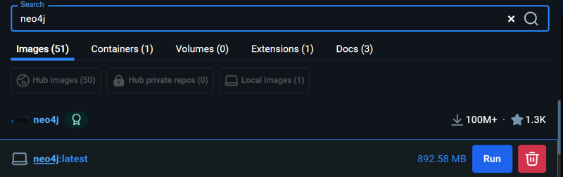
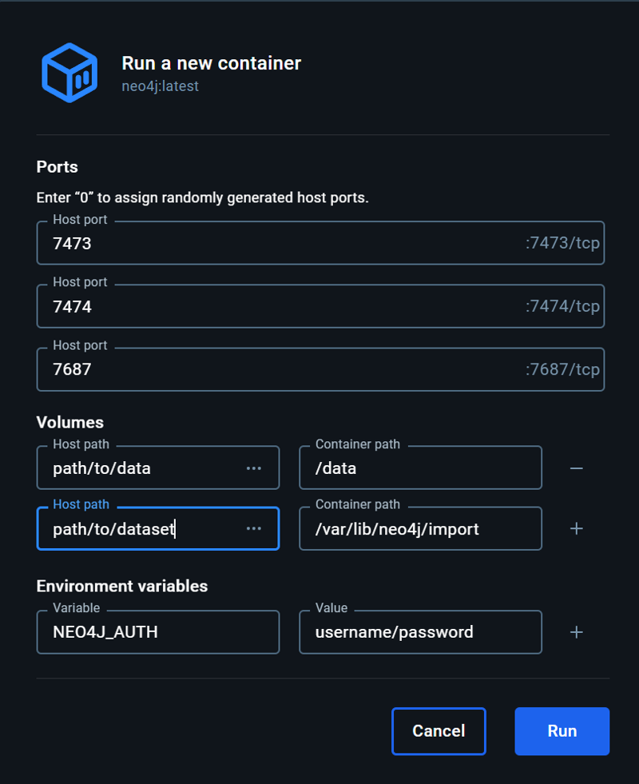

# Setting Up Neo4j Docker Container

## Step 1: Pull the Neo4j Docker Image

Search for and pull the latest Neo4j Docker image from Docker Hub.




```bash
docker pull neo4j:latest
```

---

## Step 2: Configure and Run the Container

In the Docker GUI, configure the container with the following settings:

### Ports
| Host Port | Container Port |
|-----------|----------------|
| 7473      | 7473          |
| 7474      | 7474          |
| 7687      | 7687          |

### Volumes
| Host Path         | Container Path               |
|--------------------|-----------------------------|
| `path/to/data`     | `/data`                     |
| `path/to/dataset`  | `/var/lib/neo4j/import`     |

### Environment Variables
| Variable   | Value             |
|------------|-------------------|
| `NEO4J_AUTH` | `username/password` |


```
docker run -d \
  -p 7473:7473 \
  -p 7474:7474 \
  -p 7687:7687 \
  -v /path/to/data:/data \
  -v /path/to/dataset:/var/lib/neo4j/import \
  -e NEO4J_AUTH=username/password \
  --name neo4j-container \
  neo4j:latest
```
---

## Step 3: Run the Container

Click the **Run** button to start the container.



---

## Step 4: Setup the Database

After running the container, refer to the `README.md` file in the repository for instructions on setting up and initializing the database.
