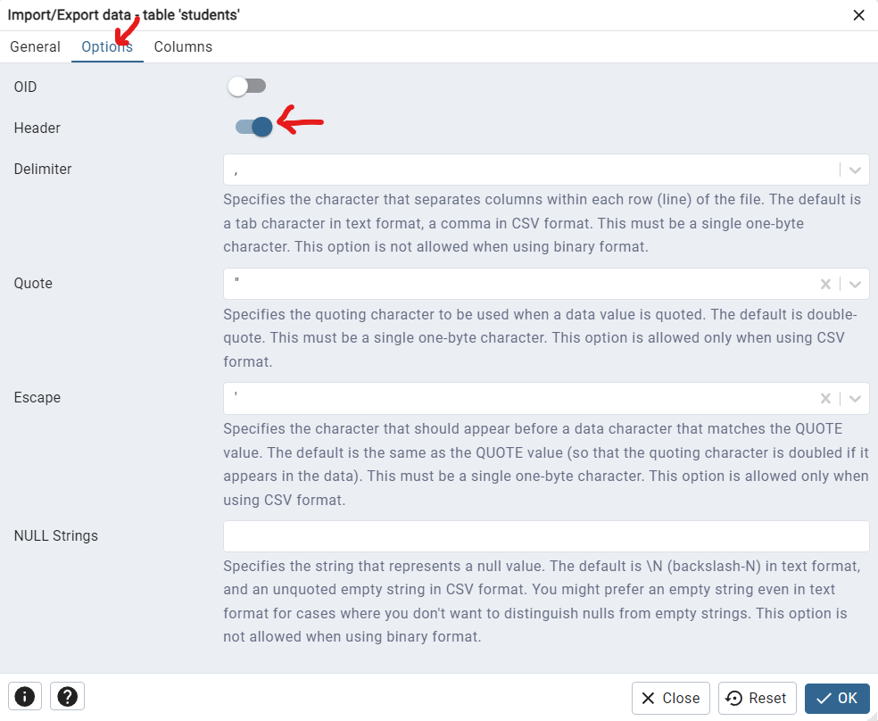

### Spatial Database Table Creation Script for PostGIS

```
-- Create sequence for students
CREATE SEQUENCE students_seq START 1;

-- Create students table
CREATE TABLE students (
    student_id BIGINT PRIMARY KEY DEFAULT nextval('students_seq'),
    university_name VARCHAR(255),
    university_id INT,
    latitude DOUBLE PRECISION,
    longitude DOUBLE PRECISION,
    geom GEOMETRY(Point, 4326)
);

-- Create sequence for universities
CREATE SEQUENCE universities_seq START 1;

-- Create universities table
CREATE TABLE universities (
    gid INT PRIMARY KEY DEFAULT nextval('universities_seq'),
    university_id INT,
    name VARCHAR(255),
    name_en VARCHAR(255),
    amenity VARCHAR(50),
    building VARCHAR(50),
    addr_city VARCHAR(255),
    name_zh VARCHAR(255),
    geom GEOMETRY(MultiPolygon, 4326)
);

-- Create sequence for regions
CREATE SEQUENCE regions_seq START 1;

-- Create regions table
CREATE TABLE regions (
    gid INT PRIMARY KEY DEFAULT nextval('regions_seq'),
    eng_name VARCHAR(255),
    chinese_name VARCHAR(255),
    geom GEOMETRY(MultiPolygon, 4326)
);
```

## `Things to aware`

### Check If Header Option is checked to make sure the import process works!
- 